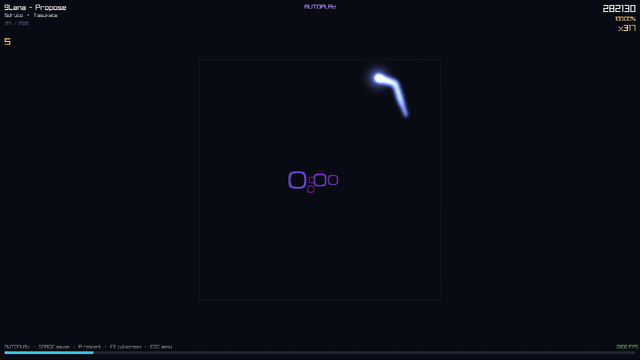
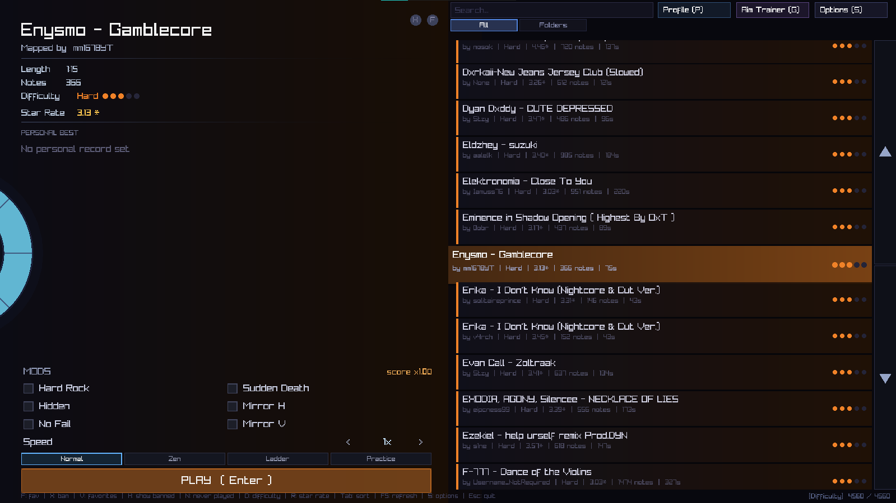

<div align="center">

# 🎯 sspm-player

### An open-source, low-end-friendly reader for **Rhythia** maps — written in **C99 + raylib**

[](https://en.wikipedia.org/wiki/C99)
[](https://www.raylib.com/)
[](#-installation)
[](LICENSE)
[](https://github.com/lolopada/sspm-player/stargazers)



<sub>🎬 <a href="https://github.com/lolopada/sspm-player/raw/main/medias/gameplay.webm">Download the full-quality gameplay video</a></sub>

</div>

---

**Rhythia** (formerly *Sound Space*) is a rhythm game by NaN Studios where notes fly toward the player and must be hit with the cursor. **sspm-player** is an independent reimplementation: it reads the same community map format (`.sspm`) and reproduces the core gameplay, with one obsession — **running well on weak hardware**. No dynamic lights, no shadows, no post-processing, and `O(visible notes)` rendering per frame.

> 🪟 Runs on **Windows** &nbsp;•&nbsp; 🐧 Runs on **Linux (Debian / Ubuntu)**

## 📑 Table of contents

- [✨ Features](#-features)
- [📦 Installation](#-installation)
- [🚀 Usage](#-usage)
- [🎮 Controls](#-controls)
- [⚙️ Options](#️-options)
- [📂 Adding content](#-adding-content)
- [📜 License](#-license)

---

## ✨ Features

| | |
|---|---|
| 🗺️ **Full `.sspm` v2 support** | Loads any community Rhythia map |
| 📁 **Subdirectory scanning** | Organize your `maps/` folder however you like |
| 🤖 **Autoplay / visualizer** | Watch maps play themselves |
| 🖱️ **Drag & drop** | Drop a `.sspm` onto the window to play it instantly |
| 🎨 **Deeply customizable** | Note speed, approach distance, palette, note shape, hitsound |
| ✨ **Custom cursors** | PNG skins with a configurable trail |
| 🧊 **Custom note meshes** | `.obj`, `.glb`, `.gltf`, `.iqm`, `.vox`, `.m3d` — auto-scaled & palette-tinted |
| 🖊️ **Tablet / stylus** | Absolute pointing mode |
| 🎯 **Aim Trainer** | Procedural sessions with configurable patterns & difficulty |
| 🔥 **Mods** | Hard Rock, Hidden, No Fail, Sudden Death, speed rate |
| 🎚️ **Audio calibration** | Built-in offset-correction tool |
| ⭐ **Favorites & PBs** | Personal bests, favorites, and map filtering |
| 🐢 **Low-end render target** | Internal 854×480 or 1280×720 upscaled for very weak GPUs |
| 💾 **Persistent settings** | Everything saved to `settings.cfg` |

---

## 📦 Installation

### 🪟 Windows — pre-built binary

No installation required — the release `.zip` is self-contained.

1. Download `sspm-player-windows.zip` from the [**Releases**](../../releases) page.
2. Extract anywhere.
3. Drop your `.sspm` files into the `maps/` folder.
4. Run `sspm-player.exe`.

### 🐧 Linux — build from source

```bash
# 1. Build dependencies
sudo apt update
sudo apt install build-essential pkg-config libraylib-dev

# 2. Clone & build
git clone https://github.com/lolopada/sspm-player
cd sspm-player
make
./sspm-player
```

Drop your `.sspm` files into `maps/` next to the binary.

<details>
<summary>📦 <strong><code>libraylib-dev</code> not available on your distro? Build raylib from source (one-time)</strong></summary>

<br>

```bash
sudo apt install git cmake libasound2-dev libx11-dev libxrandr-dev \
     libxi-dev libgl1-mesa-dev libglu1-mesa-dev libxcursor-dev libxinerama-dev
git clone --depth 1 https://github.com/raysan5/raylib
cd raylib/src
make PLATFORM=PLATFORM_DESKTOP
sudo make install
sudo ldconfig
```

</details>

---

## 🚀 Usage

```bash
./sspm-player [path] [WxH] [--fullscreen] [--autoplay] [--info]
```

| Argument | Description |
|---|---|
| `path` | A `.sspm` file (plays it directly) or a folder (opens the menu there). Defaults to `maps/`, then `.` |
| `WxH` | Window resolution, e.g. `1280x720`. Defaults to `960x540` |
| `--fullscreen` | Start in fullscreen (toggle with **F11** at any time) |
| `--autoplay` | Visualizer mode — notes are hit automatically |
| `--info` | Print map metadata to stdout and exit (no window) |

> 💡 Arguments can be given in any order.

---

## 🎮 Controls

<div align="center">
  
  <br>
  <sub>The map-selection menu — drag & drop a <code>.sspm</code>, or pick one with the arrows.</sub>
</div>

<br>

### Menu

| Key / Action | Effect |
|---|---|
| `↑` / `↓` or scroll | Navigate the map list |
| `Enter` or click | Play selected map |
| `S` | Open Options |
| `F5` | Rescan the maps folder |
| Drag & drop | Play a `.sspm` file directly |
| `Esc` | Quit |

### In-game *(after the 3 · 2 · 1 countdown)*

| Key / Action | Effect |
|---|---|
| Mouse / stylus | Aim — a note is hit when the cursor is over it as it crosses the hit plane |
| `Space` | Pause / resume |
| `R` | Restart (replays the countdown) |
| `F11` | Toggle fullscreen |
| `Esc` | Return to menu |

### Options screen *(`S`)*

`↑` / `↓` to select a setting, `←` / `→` to change its value. Changes are saved automatically to `settings.cfg` on exit.

---

## ⚙️ Options

| Setting | Description |
|---|---|
| **Approach distance** | How far away notes spawn (20–120) |
| **Approach time** | Time for a note to reach the hit plane, in ms (200–1500). Lower = faster |
| **Mouse sensitivity** | Cursor speed in relative (mouse) mode |
| **Tablet mode** | Absolute pointing for drawing tablets and styluses |
| **Audio offset** | Shift note timing to compensate for audio latency (use the calibration tool) |
| **Palette** | Color scheme for notes — presets and a fully custom mode |
| **Note shape** | Cube (default) or any 3D model from `meshes/` |
| **Hitsound** | Sound played on a hit — any file from `hitsounds/` |
| **Cursor skin** | Custom PNG cursor from `cursors/`, with trail options |
| **Cursor in menus** | Use the custom cursor skin in menus too (hides the system cursor) |
| **Resolution** | Internal render resolution (for low-end GPUs) |
| **Juice** | Visual feedback intensity on hit (particles, pulse, neon) |

---

## 📂 Adding content

All content lives in folders **next to the binary**. Subfolders are supported everywhere.

### 🗺️ Maps — `maps/`

Place `.sspm` files here. Any folder structure works:

```
maps/
├── pack-name/
│   ├── map1.sspm
│   └── map2.sspm
└── artist/
    └── hard/
        └── map3.sspm
```

Up to **8 192 maps** are loaded. Press **F5** in the menu to rescan after adding files.

### 🧊 Note meshes — `meshes/`

3D models used as note shapes instead of the default cube.
Accepted formats: `.obj`, `.glb`, `.gltf`, `.iqm`, `.vox`, `.m3d` — auto-scaled to note size and tinted by the active palette. Up to 64 meshes.

> ⚠️ **`.obj` files must be fully triangulated** (no n-gons). In Blender, enable *"Triangulated Mesh"* at export — or just use `.glb`, which is always triangulated.

### ✨ Cursor skins — `cursors/`

`.png` files, scaled automatically. Configure trail color, length, and opacity in Options.

### 🔊 Hitsounds — `hitsounds/`

Audio files (`.wav`, `.ogg`, `.mp3`, `.flac`). The selected sound plays on every hit.

### 🎨 Color palettes — `colors/`

`.txt` files defining custom note palettes:

```ini
name=My Palette
colors=ff0000,00ff00,0000ff
```

- `name` — displayed in the Options palette picker
- `colors` — comma-separated hex RGB values cycled across notes

Several palettes ship by default (`aurora.txt`, `cyberpunk.txt`, `sunset.txt`, …).

---

## 📜 License

[**GPL v3**](LICENSE) — free to use, study, modify, and share.

<sub>Not affiliated with NaN Studios or the Rhythia project. `.sspm` is a community map format; all maps belong to their respective creators.</sub>

<div align="center">
  <br>
  <sub>Built with ❤️ and <a href="https://www.raylib.com/">raylib</a> · <a href="#-sspm-player">back to top ↑</a></sub>
</div>
